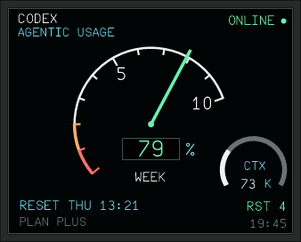
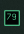

# Codex Usage Monitor — ECAM

[简体中文](README.zh-CN.md)

A compact, always-on-top Windows monitor for Codex usage, reset credits, and
the active local task's context load. Its main dial is inspired by the visual
language of the Airbus A320 ECAM, while the lower-right context arc borrows the
quantity-display idea of the Boeing 737 EICAS.

This is an independent community project, not an official OpenAI or aircraft
manufacturer product.



The background tray icon keeps the remaining percentage visible even when the
main window is hidden:



## Features

- Live remaining percentage from Codex CLI `app-server` rate-limit data.
- ECAM-style green, amber, and red thresholds.
- Current rate-limit window and reset time.
- `RST` display for available full reset credits when reported by Codex.
- `CTX K` gauge for the latest local task's context tokens in thousands.
- Borderless, draggable, always-on-top window with saved position.
- Numeric Windows tray icon with show, hide, refresh, topmost, and exit actions.
- The monitor itself is a native Windows executable with no WSL, Python, or
  PowerShell runtime dependency.

## Requirements

- Windows 10 or Windows 11, x64.
- .NET Framework 4.x, included with supported Windows installations.
- An installed and authenticated Codex CLI.

Codex CLI is deliberately **not bundled**. Install it using the current
instructions in the [official OpenAI Codex repository](https://github.com/openai/codex).
For example, the official Windows installer currently documents:

```powershell
powershell -ExecutionPolicy Bypass -c "irm https://chatgpt.com/codex/install.ps1 | iex"
```

The npm installation is also supported:

```powershell
npm install -g @openai/codex
```

Run `codex` once and choose **Sign in with ChatGPT** before starting the
monitor.

## Quick start

1. Download `CodexEcamMonitor-v1.0.0-win-x64.zip` from GitHub Releases.
2. Verify the optional `.sha256` checksum and extract the ZIP to a normal
   writable directory.
3. Install and authenticate Codex CLI as described above.
4. Double-click `Start Codex ECAM Monitor.bat` or `CodexEcamMonitor.exe`.
5. Drag the monitor to the desired display. Its position is restored on the
   next launch.

The monitor refreshes once per minute. Press `F5` or choose **Refresh now**
from the right-click menu for an immediate update.

## How Codex CLI is found

The monitor resolves the CLI in this order:

1. The path in `CODEX_CLI_PATH` (`.exe`, `.cmd`, or `.bat`).
2. A legacy `codex.exe` beside `CodexEcamMonitor.exe`.
3. `codex.exe`, `codex.cmd`, or `codex.bat` in the Windows `PATH`.

For a non-standard installation, set an explicit path and restart the monitor:

```powershell
setx CODEX_CLI_PATH "C:\Tools\Codex\codex.exe"
```

New environment variables become visible to applications launched after the
next sign-in or after restarting the launching shell.

If no CLI is found, the monitor stays open in `NO DATA` state and displays an
installation hint instead of crashing.

## Reading the display

- The large percentage is the remaining amount in the longest rate-limit
  window returned by Codex.
- The red and amber scale segments mark low remaining capacity.
- `WEEK`, `DAY`, `HR`, or `MIN` identifies the active window duration.
- `RESET` is the next reset time in local time.
- `RST` is the number of full reset credits reported by the account.
- `CTX K` reads the most recently active local Codex task's context tokens;
  the white 240-degree arc shows its share of that model's context window.

`CTX K` is local task state, not an account token bill, and does not affect the
main percentage.

## Tray controls

- Double-click the tray icon to show or hide the monitor.
- Right-click for **Show monitor**, **Hide to tray**, **Refresh now**,
  **Always on top**, and **Exit**.
- Green is normal, amber means 20% or less, red means 10% or less, and `--`
  means no current data.
- Windows may initially place a new tray icon in the hidden-icons overflow.

## Privacy and local data

The application contains no telemetry of its own. It starts the locally
installed Codex CLI and calls `account/rateLimits/read` through its local
`app-server` standard-I/O interface.

To avoid sharing Codex App database state, the monitor uses
`%LOCALAPPDATA%\CodexEcamMonitor\codex-home` and copies available Codex login
credential files from `%USERPROFILE%\.codex`. It also reads up to the final
4 MB of the latest local session log from today or yesterday to obtain the
`CTX K` value. Credentials and session logs are never included in builds or
release packages.

## Build from source

From a Windows command prompt:

```bat
scripts\build.cmd
```

This uses the .NET Framework x64 C# compiler included with Windows and writes
the application to `dist\CodexEcamMonitor.exe`.

To build the complete release archive:

```powershell
powershell -ExecutionPolicy Bypass -File scripts\package-release.ps1 -Version 1.0.0
```

The ZIP and checksum are written to `release\`. The packaging script rejects
credentials, session logs, `codex.exe`, and files larger than 100 MB.

## Troubleshooting

- **NO DATA / CLI NOT FOUND:** install Codex CLI, run `codex` once to sign in,
  or set `CODEX_CLI_PATH`.
- **NO DATA after an upgrade:** press `F5`; if the issue persists, confirm
  `codex app-server --stdio` starts with the installed CLI. This project uses
  an upstream app-server interface that may evolve.
- **Tray icon is missing:** open the Windows hidden-icons overflow.
- **Font looks different:** keep `assets\ECAMFontRegular.ttf` beside the EXE.

## License and attribution

Codex ECAM Monitor is distributed under GPL-3.0. The bundled Display-EIS font
comes from the GPL-3.0 FlyByWire aircraft project. The A320 ECAM and FlightGear
737 EICAS design references, external Codex CLI dependency, and trademark
disclaimer are documented in [NOTICE.md](NOTICE.md).
